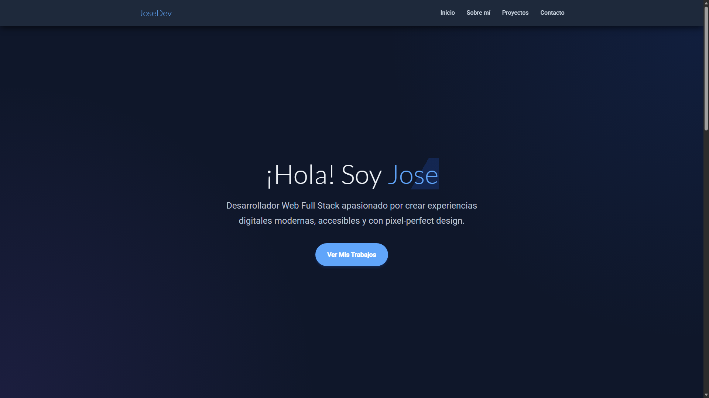
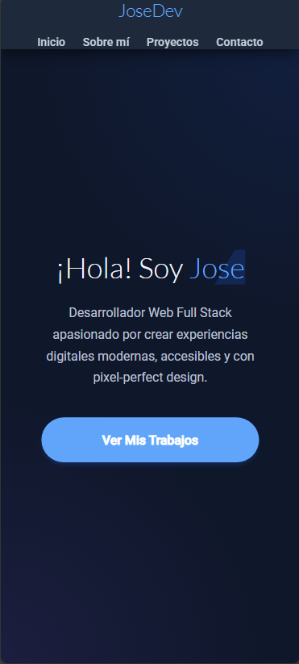

# Portafolio Personal - Tema 4

**Nombre y Apellidos:** José Palma López
**Asignatura:** Diseño de Interfaces Web - Tema 4
**Finalidad:** Creación de un portafolio personal
utilizando exclusivamente HTML y CSS, implementando diseño responsive, modo oscuro y animaciones avanzadas.

## 🔗 [https://portfolio-tema4.vercel.app/](https://portfolio-tema4.vercel.app/)
[Enlace a Vercel aquí]

---

## 📄 Descripción del Portafolio

Este proyecto consta de una única página (`index.html`) estructurada en 4 secciones principales, diseñadas para adaptarse a cualquier dispositivo.

### Secciones:
1.  **Inicio (Hero):** Presentación principal con un diseño limpio, título llamativo y llamada a la acción.
2.  **Sobre Mí:** Breve biografía acompañada de una fotografía con fondo transparente y efecto 3D al interactuar.
3.  **Proyectos:** Galería de trabajos destacados usando Grid Layout, con imágenes optimizadas en formatos modernos (AVIF, WEBP) y fallbacks.
4.  **Contacto:** Formulario de contacto centrado con validación visual y estilos personalizados.

### Características Técnicas:
-   **HTML Semántico:** Uso correcto de etiquetas `header`, `nav`, `main`, `section`, `article`, `footer`.
-   **CSS Moderno:** Uso de `CSS Custom Properties` (Variables) para gestionar la paleta de colores y tipografía.
-   **Modo Oscuro:** Implementación completa de tema claro/oscuro mediante `@media (prefers-color-scheme: dark)`.
-   **Animaciones:**
    -   *Scroll-driven Animations:* Elementos que aparecen al hacer scroll.
    -   *Transiciones:* Suavidad en botones y enlaces.
    -   *3D:* Efecto de rotación en la imagen de perfil.
-   **Assets:**
    -   Iconos SVG.
    -   Imágenes en formatos PNG, WEBP y AVIF.
    -   Fuentes locales (Roboto y Lato).

---

## 📸 Capturas de Pantalla

### Versión Escritorio

### Versión Móvil

---

## 🛠 Instalación y Uso

1.  Clonar el repositorio.
2.  Abrir `index.html` en tu navegador web.
3.  Para ver el modo oscuro, cambia la preferencia de tema de tu sistema operativo.
